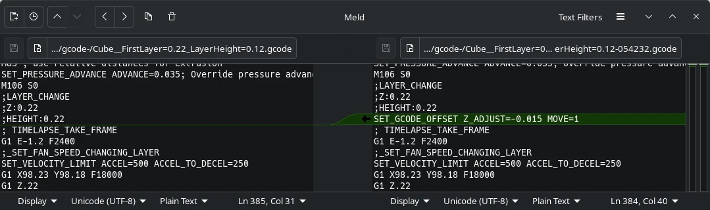
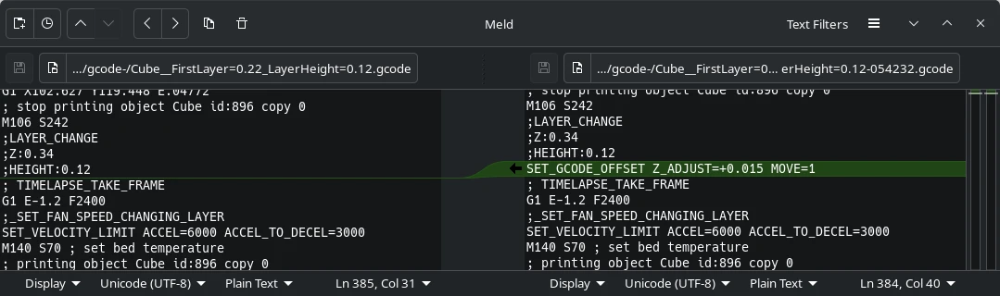

<!-- markdownlint-disable MD041 MD028 MD040 MD033-->

> [!CAUTION]
> You can damage your 3d printer if not used correctly!

> [!WARNING]
> I am creating these files for my personal use and cannot be held responsible for what it might do to your printer. Use at your own risk.

# zoffset-adjuster

Adjusts the `z_offset` in gcode files for early layers. E.g., if you prefer more layer squish for the first layer, and then normal layer squish for subsequent layers.

This is especially useful for users with a warped bed, or with a bed that has poor layer squish, or adhesion, in particular spots.

Run with `--help` for more information.

## How

1. Inserts `SET_GCODE_OFFSET Z_ADJUST={VALUE} MOVE=1` before starting the **first layer**.
    - Both positive and negative values are acceptable.
1. Inserts `SET_GCODE_OFFSET Z_ADJUST={OPPOSITE_VALUE} MOVE=1` at the requested layer.
    - Requested layer can be anything from 2 to the last layer.




## Usage

```
./zoffset-adjuster

./zoffset-adjuster --help

./zoffset-adjuster ./Cube.gcode 

./zoffset-adjuster --input ./Cube.gcode

./zoffset-adjuster --silent --input ./Cube.gcode --first-layer-height 0.26 --layer-height 0.12 --revert-z-offset-at-layer 110 --z-offset -0.015
```

### Example

In this example, a `cube` was sliced with `first layer height: 0.22 mm` and `layer height: 0.12 mm`. I prefer more layer squish only on the first layer, so the `z_offset` adjustment will be reverted, undone, at layer 2.

```
➜ ./zoffset-adjuster ./Cube.gcode 
> Selected file: ./Cube.gcode
> How much to adjust z_offset by? -0.015 mm
> What is the height of the first layer? 0.220 mm
> What is the height of the other layers? 0.120 mm
> At the start of what layer do you want to undo the Z offset adjustment? 2

Inserting z_offset adjustment at line 108
Inserting z_offset reversion at line 384

./Cube-054539.gcode generated!
Goodbye! 😀
```

### Default Settings

On first run, a `settings.toml` will be generated. Feel free to adjust with your standard settings.

```toml
z_offset = -0.015
first_layer_height = 0.26
layer_height = 0.2
revert_z_offset_at_layer = 2
```

## Notes

- Klipper only.
- Tested to work with `Orca Slicer 2.3.2`.
- Original `.gcode` will not be changed.
- Will not work with `adaptive layers`.
- There are sanity checks, so wrong inputs will be caught.
- Only tested on `linux`, for now.

## Developer notes

Looks for this sequence in the `gcode`.

```rust
    impl GCode {
        const LAYER_CHANGE: &'static str = ";LAYER_CHANGE";
        const CURRENT_PRINT_HEIGHT: &'static str = ";Z:";
        const CURRENT_LAYER_HEIGHT: &'static str = ";HEIGHT:";
    }
    // NOTE example sequence found in OS 2.3.2
    // first layer height is 0.22
    // layer height is 0.12
    // NOTE first layer
    // ;LAYER_CHANGE
    // ;Z:0.22
    // ;HEIGHT:0.22
    // NOTE third layer
    // ;LAYER_CHANGE
    // ;Z:0.46
    // ;HEIGHT:0.12
```
